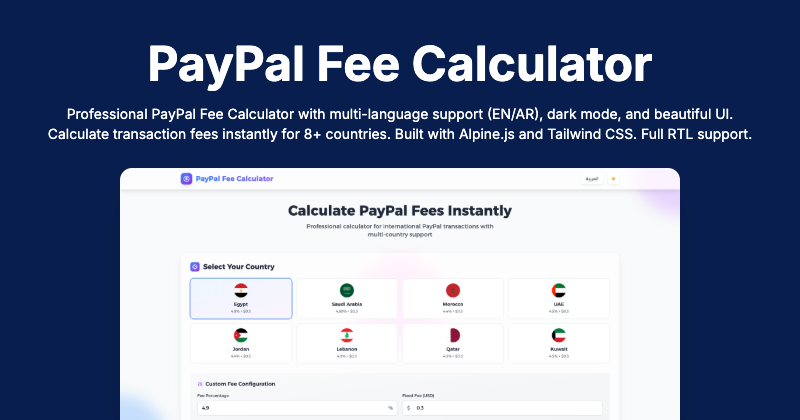
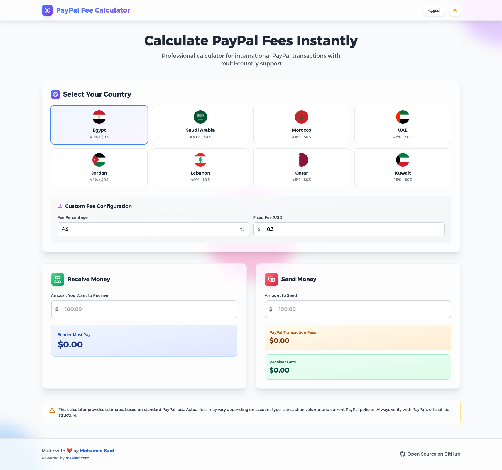
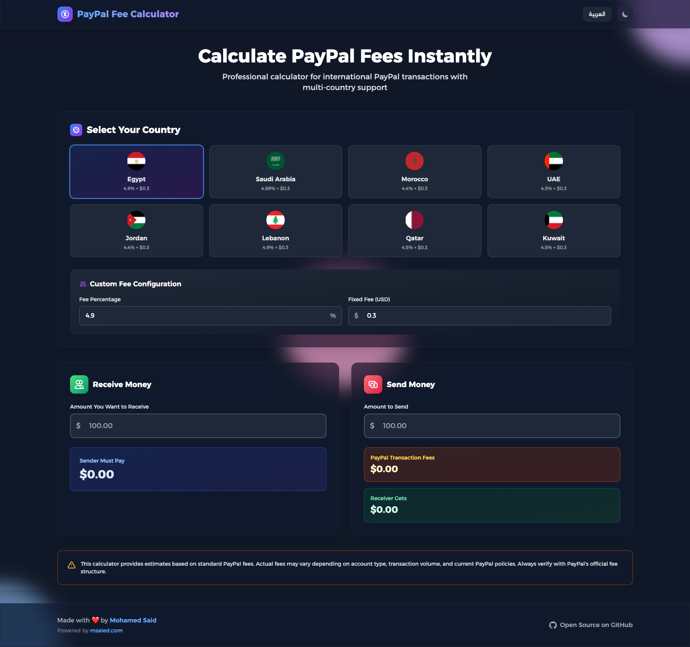

# PayPal Fee Calculator 🌍💸

A professional, multi-language PayPal fee calculator that supports various countries and currencies. This tool allows users to quickly estimate the PayPal fees associated with sending or receiving money internationally.



## 🌐 Live Demo

👉 [paypal-fee-calculator.msaied.com](https://paypal-fees.msaied.com)

## ✨ Features

- 🌎 Supports multiple countries and currencies
- 🌗 Light and dark mode
- 🧮 Two-way calculation:
  - **Send**: Calculate how much the receiver gets
  - **Receive**: Calculate how much the sender must pay
- 🛠 Custom fee configuration
- 🌍 Language toggle (English / العربية)
- 📱 Fully responsive design
- 🧊 Glassmorphism UI with smooth animations

## 🚀 Technologies Used

- [Tailwind CSS](https://tailwindcss.com/)
- [Alpine.js](https://alpinejs.dev/)
- Vanilla HTML & JavaScript
- RTL Support

## 📸 Screenshots

|          Light Mode          |         Dark Mode          |
|:----------------------------:|:--------------------------:|
|  |  |

## 📦 Usage

You can simply clone the repository and open the `index.html` file in your browser:

```bash
git clone https://github.com/EG-Mohamed/Paypal_Fee_Calculator.git
cd Paypal_Fee_Calculator
open index.html
